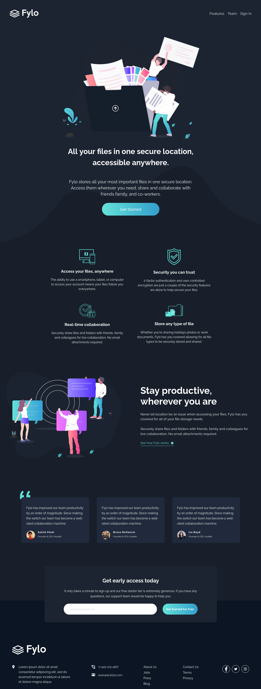
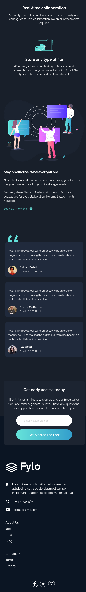

# Frontend Mentor - Fylo dark theme landing page solution

[Fylo dark theme landing page challenge on Frontend Mentor](https://www.frontendmentor.io/challenges/fylo-dark-theme-landing-page-5ca5f2d21e82137ec91a50fd) 

## Table of contents 

- [Overview](#overview)
  - [The challenge](#the-challenge)
  - [Screenshot](#screenshot)
  - [Links](#links)
- [My process](#my-process)
  - [Built with](#built-with)
  - [What I learned](#what-i-learned)
  - [Continued development](#continued-development)
- [Author](#author)
- [Acknowledgments](#acknowledgments)

## Overview

### The challenge

Users should be able to:

- View the optimal layout for the site depending on their device's screen size (1440px and 375px)
- See hover states for all interactive elements on the page
# Challenge Startup Landing Page

[Fylo dark theme landing page challenge on Frontend Mentor](https://www.frontendmentor.io/challenges/fylo-dark-theme-landing-page-5ca5f2d21e82137ec91a50fd) 
!

### Screenshot

### Links

- Solution URL: [check the project soluction here](https://github.com/Jean-kassyl/fylo-landingPage)
- Live Site URL: [live site demo](https://jean-kassyl.github.io/fylo-landingPage/)

## My process

### Built with

- Semantic HTML5 markup
- CSS custom properties
- Flexbox
- Grid

### What I learned
I've learned a lot by doing this project. Some of the things I have learned
are about: 
- how to position a background image
- how to use Grid 
- working with images in general

### Continued development

I have tried my best to make the project looks a little bit like the original but I think there is still things I would need to change. I still need to continue learning about some background properties like ` background-size` and `background-position`.
I also need to continue working with flexbox and grid and more importantly get confortable using images in general.

## Author

- LinkedIn - [Jean Marc Kassyl Covi](https://www.linkedin.com/in/jean-marc-kassyl-covi-892548204/)

## Acknowledgments

This project was only possible because of Frontend mentor. I address My sincere thank to them as they are working hard to make us better developers.

